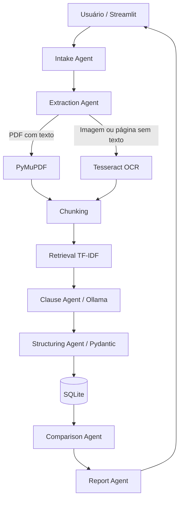

# Arquitetura técnica

## Princípios

- Separação clara de responsabilidades.
- IA generativa restrita a interpretação semântica.
- Regras determinísticas para comparação objetiva.
- Evidência de origem em toda informação relevante.
- Componentes locais e substituíveis.
- Configuração por variáveis de ambiente.

## Fluxo

## Decisão: recuperação TF-IDF no MVP

Um banco vetorial seria adequado para produção, mas adicionaria instalação, embeddings e consumo de recursos ao desafio. O MVP usa TF-IDF local para reduzir dependências. A interface `RetrievalService` pode ser substituída posteriormente por Qdrant, Chroma ou pgvector.

## Decisão: Ollama

Mantém o conteúdo das apólices no ambiente local e elimina a necessidade de chaves externas. O modelo é configurável por `.env`.

## Decisão: JSON Schema

A chamada ao Ollama solicita saída estruturada conforme schema Pydantic. Isso reduz parsing frágil e transforma a resposta do modelo em contrato explícito entre o agente semântico e os componentes determinísticos.

## Observabilidade mínima

O MVP expõe status de processamento na interface. Para produção, recomenda-se adicionar logs estruturados, métricas por agente, tempo de processamento, tokens, taxa de falha e avaliação de qualidade por campo.
